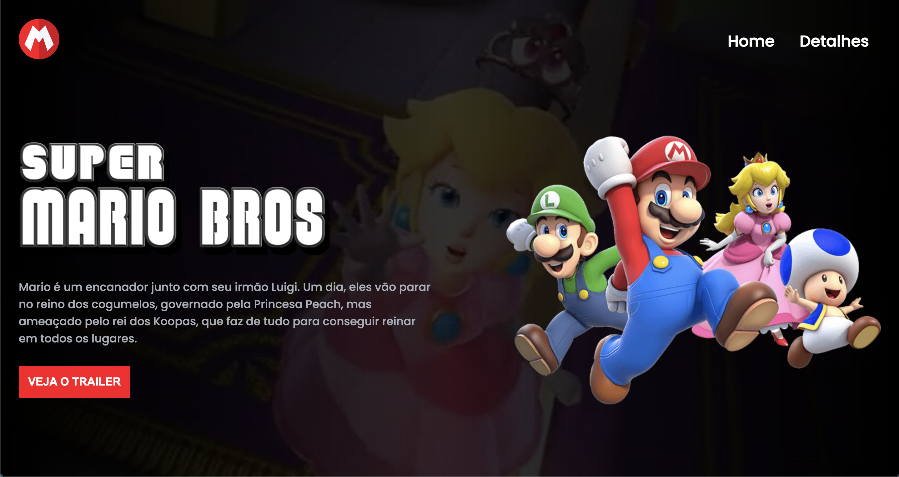

<h1 align="center"> Home page - Mario </h1>

Página feita durante o evento Dev em Dobro  

  <a href="#-tecnologias">Tecnologias</a>&nbsp;&nbsp;&nbsp;|&nbsp;&nbsp;&nbsp;
  <a href="#-projeto">Projeto</a>&nbsp;&nbsp;&nbsp;|&nbsp;&nbsp;&nbsp;
  <a href="#-layout">Layout</a>&nbsp;&nbsp;&nbsp;|&nbsp;&nbsp;&nbsp;
  <a href="#memo-licença">Licença</a>

 

  

## 🚀 Tecnologias

Esse projeto foi desenvolvido com as seguintes tecnologias:

- HTML e CSS
- JavaScript
- Git e Github

## 💻 Projeto

Essa página é feita com base no filme que está para ser lançado, contendo um pequeno resumo e com um botão para clicar e abrir o trailer.

- [Visite o projeto online](https://marcosroncaglia.github.io/mario-home/)
# mario-home
